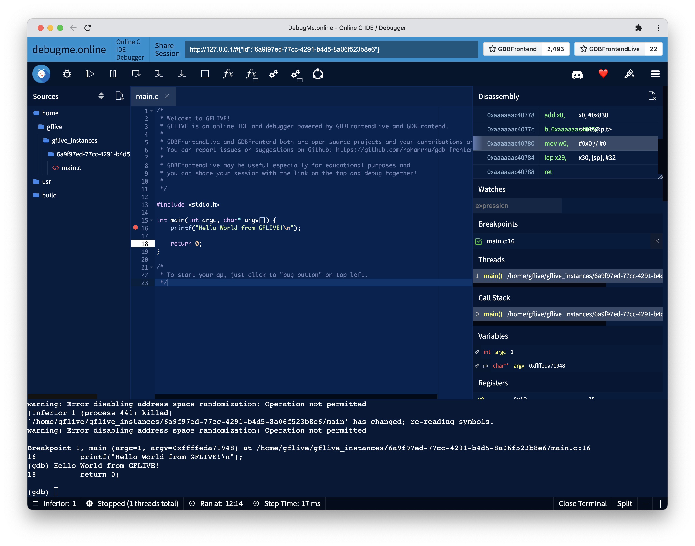

# `gdb-frontend-live`: online ide/debugger platform based on [gdb-frontend](https://github.com/rohanrhu/gdb-frontend) 🛸👽🌌

GDBFrontendLive is a server that creates GDBFrontend instances and provides an online sharable IDEs for each individiual users.

[](https://github.com/rohanrhu/gdb-frontend/releases)
[](https://github.com/rohanrhu/gdb-frontend/issues)
[](https://github.com/rohanrhu/gdb-frontend/network)
[](https://github.com/rohanrhu/gdb-frontend/stargazers)
[](https://discord.gg/RyVY9MtB4S)
[](https://patreon.com/EvrenselKisilik)
[](#%EF%B8%8F-donate)



## Architecture

```text
+----------------+        +------------------------+
|                +-------->                        |
|    Client      |        |    GDBFrontendLive     |
|   (Browser)    |        |         Server         |
|                <--------+                        |
+--^--+----------+        | +-----Instances------+ |
   |  |                   | |                    | |
   |  |                   | | +----------------+ | |
   |  |                   | | |                | | |
   |  +----------------------->                | | |
   |                      | | |  GDBFrontend   | | |
   +--------------------------+                | | |
                          | | |                | | |
                          | | +----------------+ | |
                          | |        ...         | |
                          | +--------------------+ |
                          +------------------------+
```

## What is this exactly?

GFLive provides a platform that creates online shareble IDE/debuggers for each individual user. Once you create an IDE instance, you can share your session and debug together.

This project may useful for especially educational institutions or teams; they can setup their own GFLive platforms and provide online shareble IDEs. Also, of course it may be useful for individual usages; you can create a lot of debugger instances and use and share them to your friends.

GDBFrontend is a debugger in fact for now but it provides basic editing features and full access to terminal on a `tmux` session. So you can use even Vim in the terminal or do something else. With debugging features, editing/IDE features will be improved in-time. You can contribute to project, all PRs are welcome.

**Note:** Still both projects GFlive and GF are very new and on alpha stages.

## Use with Docker Containerization

You can use GFLive with Docker easily.

Install [Docker](https://www.docker.com/), and follow these simple steps:

Get the latest GIT revision:

```bash
git clone --recursive https://github.com/rohanrhu/gdb-frontend-live.git
cd gdb-frontend-live
```

Run GFLive container easily:

```bash
docker build --tag gflive .
docker run --name gflive -p 80:80 gflive
```

Now you can use GFLive on the URL: `http://127.0.0.1/`

To stop your container you can use Docker Desktop or use command line of Docker:

```bash
docker container stop gflive
```

To remove the container and Docker image you can do these:

```bash
docker container rm gflive
```

```bash
docker image rm gflive
```

### Security with Docker

If you are using Docker you can ignore full-system access issue for security since everything will work in VMs but if you want to restrict outgoing internet traffic
for GFLive's debugger instances, you still need to restrict internet access; you can do that by using `iptables` for the user that is running Docker if you are using Linux.

## Security

GFLive provides full access on instance user and group that are set by `--instance-user`/`--instance-group`, so the IDE instances can access each other and internet! Also you must be careful for your open ports or DMZ option on your router; if you dont use a router, you must use firewall or setup a complex autharization architecture based on users and ports.

You can use `iptables` to restrict outgoing internet traffic of GFLive's debugger instances.

```bash
sudo iptables -A OUTPUT -m owner --uid-owner $(id -u gflive) -j DROP
```

## Other Parts

### GDBFrontend: [gdb-frontend](https://github.com/rohanrhu/gdb-frontend)

GDBFrontend to create instances.

### Adapter: [gdb-frontend-live-adapter](https://github.com/rohanrhu/gdb-frontend-live-adapter)

GDBFrontend adapter plugin for adopting instance to GDBFrontendLive.

### Client: [gdb-frontend-live-client](https://github.com/rohanrhu/gdb-frontend-live-client)

Frontend client that connects to GDBFrontendLive server.

## Build

You can build it with GNU Make.

```bash
make clean; make
```

## Requirements

GFLive does not require anything except [GDBFrontend Requirements](https://github.com/rohanrhu/gdb-frontend#requirements). **You must provide requirements for GDBFrontend.**

## Usage

```text
# ./server -h
GDBFrontendLive v0.0.1-alpha
Usage: gdbfrontendlive [options]
Options:
        --help, -h:                             Shows this help text.
        --version, -v:                          Shows GDBFrontendLive and GDBFrontend versions.
        --host-address=IP, -H IP:               Specifies bind address.
        --bind-address=IP, -l IP:               Specifies host address. (Default is 127.0.0.1)
        --ws-port=PORT, -wsp PORT:              Specifies GDBFrontend websocket server's port.
        --instance-user=USER, -u USER:          Sets the user that runs instances.
        --instance-group=GROUP, -g GROUP:       Sets the group that runs instances.
```

Start server with an instance user:

```bash
./server --instance-user=USERNAME
```

### Notices

* You must run the server as root because it sets uids and gids of instance processes.
* CWD must be the directory of server executable.

## Client API/Interface

GFLive provides a WebSocket server to clients. The server uses serialized JSONs for messaging. HTTP server for client is a TODO; you can use [gdb-frontend-live-client](https://github.com/rohanrhu/gdb-frontend-live-client) on `file://` (without a http server) or serve it a simple http server like Apache HTTPD.

## Does it support Windows?

No. You can use it on Linux.

### Does it support WSL?

GDBFrontend supports WSL but GFLive does not.

### Issues about WSL

* GFLive needs random ports and on WSL 1, Random port option is not usable on WSL becasue `/proc/net/tcp` interface is not working on WSL. (WSL 2 does not has this problem.)

## Versioning

Since v0.1.0-git, GFLive switched to a new versioning strategy.

### Reading Versions

In `vX.Y.Z-STABILITY`:

* `X` is **major** versions, changes long term with major features and enhancements.
* `Y` is **main** versions that include new features and enhancements.
* `Z` is **bugfix** releases of main versions.
* `STABILITY` is stability level of the release. (`alpha`, `beta`, `rcN`, `stable`)

## Documentation

Documentation is TODO yet.

## Contributing

All PRs are welcome.

## ❤️ Donate

### Patreon

[](https://patreon.com/EvrenselKisilik)

### Bitcoin

You can donate for supporting me :)

| QR Code                                                        | Bitcoin address for donations                |
| -------------------------------------------------------------- | -------------------------------------------- |
|  | **3KBtYfaAT42uVFd6D2XFRDTAoErLz73vpL** |

Other currencies:

| Currency | Address                                    |
| -------- | ------------------------------------------ |
| BTC      | 3KBtYfaAT42uVFd6D2XFRDTAoErLz73vpL         |
| ETH      | 0xCa422B014A6F588606864ef2d0C40ec2E5d83DFE |
| USDT     | 0xCa422B014A6F588606864ef2d0C40ec2E5d83DFE |
| USDC     | 0xCa422B014A6F588606864ef2d0C40ec2E5d83DFE |
| XMR      | 88qvS4sfUnLZ7nehFrz3PG1pWovvEgprcUhkmVLaiL8PVAFgfHjspjKPLhWLj3DUcm92rwNQENbJ1ZbvESdukWvh3epBUty |

## License

GNU General Public License v3 (GPL-3)

You may copy, distribute and modify the software as long as you track changes/dates in source files. Any modifications to or software including (via compiler) GPL-licensed code must also be made available under the GPL along with build & install instructions.
